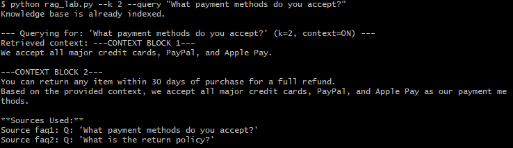
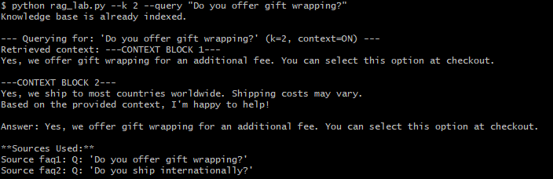
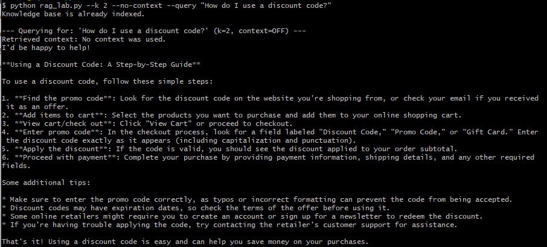
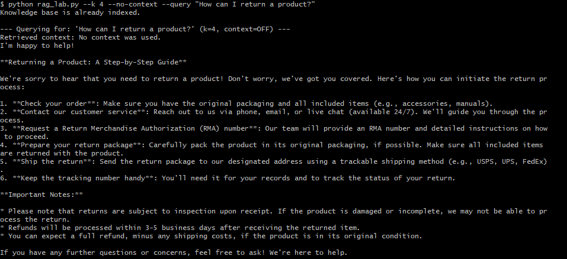
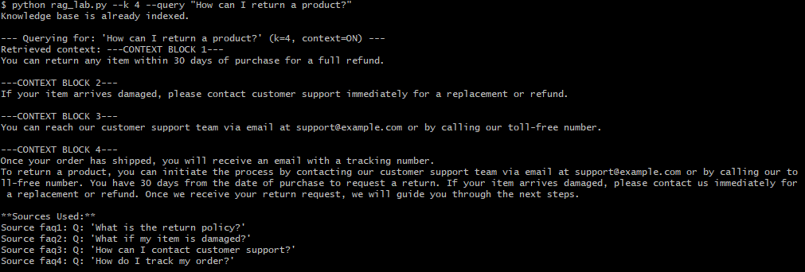

# Prompt Playbook v1, week2

## 1.Run baseline & capture one example answer

 

**--- Querying for: 'How can I return a product?' ---**
Retrieved context: You can return any item within 30 days of purchase for a full refund.
If your item arrives damaged, please contact customer support immediately for a replacement or refund.
Answer: To return a product, you can do so within 30 days of purchase for a full refund. If your item arrives damaged, please contact customer support immediately to arrange a replacement or refund.

## 2.Add CLI parsing (argparse) for: `--k`, `--no-context`, `--query "..."`
 

**--- Querying for: 'How can I return a product?' (k=1, context=OFF) ---**
Retrieved context: No context was used.
**Return Policy**

We're sorry to see that you're not satisfied with your purchase! Returning a product is easy and hassle-free with us. Here's how:

1. **Check if the item is eligible for return**: Before initiating the return process, please ensure that the product meets our return policy requirements (e.g., item is in its original condition, etc.). You can find more information on our return policy page.
2. **Contact Our Customer Service Team**: Reach out to us via phone, email, or live chat with your order number and reason for returning the product. We'll guide you through the process and provide a Return Merchandise Authorization (RMA) number.
3. **Pack the item carefully**: Place the product in its original packaging, if possible, and ensure it's securely packaged to prevent damage during transit.
4. **Ship the item back**: Send the package to us with your RMA number clearly marked on the outside of the package. Please note that you'll need to pay for return shipping costs unless the item is defective or was sent in error.
5. **Wait for your refund or exchange**: Once we receive and inspect the returned product, we'll process a refund or arrange an exchange (if applicable). Refunds will be issued in the original form of payment.

**Important:**

* Please allow 3-5 business days for us to process your return request.
* Items that are not defective or were used may be subject to a restocking fee.
* You'll receive an email confirmation once your return is processed.

If you have any further questions or concerns, feel free to ask!

## 3. Implement context delimiter block (e.g. `---CONTEXT BLOCK i---`)
 

**--- Querying for: 'How can I return a product?' (k=1, context=ON) ---**
Retrieved context: ---CONTEXT BLOCK 1---
You can return any item within 30 days of purchase for a full refund.
Based on the provided context, I'd be happy to help!

According to the context, you can return a product within 30 days of purchase for a full refund. To initiate the return process, follow these steps:

1. Check if the item is eligible for return: Verify that the item was purchased within the last 30 days.
2. Prepare your return: Carefully package the item in its original condition and include any original packaging materials (if applicable).
3. Contact our customer service: Reach out to our support team via phone, email, or chat (depending on the channel you prefer) and provide your order number, reason for return, and other necessary details.
4. Get a Return Merchandise Authorization (RMA): We'll issue an RMA number to ensure that your return is processed correctly.
5. Ship the item back: Send the package with the RMA number to our designated returns address.

Please note that you should check our website or contact customer service for specific return shipping instructions and any potential restocking fees.

If you have any further questions or concerns, feel free to ask!

## 4.Add citation list at end of answer (post-process append)
 

**--- Querying for: 'How can I return a product?' (k=1, context=ON) ---**
Retrieved context: ---CONTEXT BLOCK 1---
You can return any item within 30 days of purchase for a full refund.
Based on the provided context, it seems that returning a product is a straightforward process. Here's a possible answer:

**How can I return a product?**

According to our policy, you can return any item within 30 days of purchase for a full refund. To initiate the return process, please contact our customer service team and provide your order number and reason for return. We'll guide you through the next steps and ensure that your return is processed smoothly.

If you have any further questions or concerns, feel free to ask!

**Sources Used:**
Source faq1: Q: 'What is the return policy?'

# 5. Compare 3 queries with and without context (log differences)

| Query | k | Context | Response |
|-------|---|---------|----------|
| What payment methods do you accept? | 2 | ON |  |
| Do you offer gift wrapping? | 2 | ON |  |
| How do I use a discount code? | 2 | OFF |  |

# 6. Increase n_results to 4; observe noise vs completeness

Without context

With context

| Query | Mode (raw/RAG) | k | Retrieved IDs | Strengths | Weaknesses | Failure Modes | Notes |
|-------|----------------|---|---------------|-----------|------------|---------------|-------|
|How can I return a product?| RAW | 1 | N/A | Grounding(5) Brevity(5) | Relevance(1) Completeness(1) Traceability(1)|partial|The process is clear to return a product, however this does not provide links to continue the process or which agency receives the product, the response is very general |
| How can I return a product? | RAG | 1 | None |  Grounding(5) Relevance(5) Completeness(5) Brevity(5)| Traceability(1) | Partial | More clear about the time that I have to return my product |
| What payment methods do you accept? | RAG | 2 | faq5 and faq1 | Relevance(5) Completeness(5) Brevity(5) | Grounding(1) Traceability(1)| leakage | Take a question "How can I return a product?" again for the context block 2"| 
| Do you offer gift wrapping? | 2 | RAG | faq8 and faq3 | Relevance(5)  Brevity(5) | Grounding(1) Completeness(1) Traceability(1) | no-hit in the context-block 2 | 
| How do I use a discount code? | 2 | RAW | N/A | Grounding(5) Relevance(5)  Brevity(5) Completeness(5) Traceability(5) | N/A | - |
| How can I return a product? | 4 | RAW | N/A | Grounding(5) Relevance(5)  Brevity(5) Completeness(5) Traceability(5) | N/A | - ||
| How can I return a product? | 4 | RAG | faq1, faq10, faq4, faq2 | Relevance(5)  Brevity(5) Completeness(5) | Grounding(1) Traceability(1) | not hit, leakage | the context-block 2, 3,4 are not according to the principal query|

# Reflection Prompts

1. Where did additional context hurt answer quality?

When the context is provide it and the k is different to 0 or 1, the model hallucinates, and the query change, generating a inconsistent result 

2. Which failure mode appeared most often?
no-hit only when the context is provide it and and when k is greater than 1 

3. What is your next improvement priority & why?

Validations about context should be added when the k is greater than 1 and verify if the context is according to the query